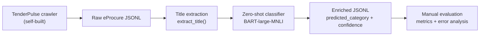

<div align="center">

# TenderPulse ML

### I classified Indian government tenders by procurement category using data I collected myself.

[](#results)
[](#results)
[](#results)
[](#how-it-works)

**TenderPulse crawler -> title extraction -> zero-shot classification -> enriched JSONL**

[TenderPulse crawler](https://github.com/Sehaan-1/Tender-Royal-Pulse) |
[Evaluation notebook](notebooks/03_evaluation.ipynb) |
[Classifier](src/classify.py)

</div>

---

## The Problem

eProcure publishes thousands of Indian government tenders, but the listing data is hard to search by what is actually being bought.

Titles are available. Structured procurement categories usually are not.

That makes it harder for analysts, businesses, and journalists to answer simple questions:

| Question | Why it is hard |
|---|---|
| Which tenders are buying physical goods? | Titles mix procurement, repair, installation, and service language. |
| Which tenders are civil works? | Construction, maintenance, and electrical works are often phrased inconsistently. |
| Which tenders are services? | Consultancy, operations, AMC, licensing, and event work overlap with other categories. |

This repo turns raw tender titles into a searchable category signal: **Goods**, **Services**, or **Works**.

---

## What This Does

| Artifact | What it is | Why it matters |
|---|---|---|
| **TenderPulse** | A crawler I built for eProcure data collection. | The data was collected from the source portal, not downloaded from a ready-made ML dataset. |
| **tenderpulse-ml** | This repo: title cleaning, zero-shot classification, evaluation, and notebooks. | It converts raw tender listings into enriched records with category predictions. |
| **Committed sample data** | 200 real, PII-checked tender records. | The project can be inspected and evaluated without needing a fresh scrape. |

---

## Results

Manual evaluation was done on **125 predictions**: 100 proportional records plus 25 additional predicted-Goods records to inspect the minority class more honestly.

| Class | Precision | Recall | F1 |
|---|---:|---:|---:|
| **Goods** | **0.897** | 0.553 | 0.684 |
| **Services** | 0.500 | **0.818** | 0.621 |
| **Works** | 0.812 | **0.886** | **0.848** |

| Metric | Value |
|---|---:|
| Representative accuracy | **70.0%** |
| Zero-rule baseline, always predict Works | 54.0% |
| Margin over baseline | **+16.0 percentage points** |
| Strict representative accuracy, uncertain labels counted wrong | 63.0% |

The important part is not just overall accuracy. The distribution is skewed toward Works, so the evaluation calls out the minority-class behavior directly: **Goods precision is strong, but Goods recall is still the biggest gap.**

---

## Demo

Raw eProcure titles go in. Category predictions come out.

| Before: tender title | After: predicted category |
|---|---|
| `Rate Contract for the procurement of Chemicals, Glassware, Plasticware and other Laboratory Consumables` | **Goods** (`0.960`) |
| `Painting works in Classrooms (AB-1, AB-2 and LHC) at IISER Mohali` | **Works** (`0.964`) |
| `Empanelment of Event Management Agencies for Executing National Level Events` | **Services** (`0.966`) |

Each enriched JSONL record keeps the original tender fields and adds:

```json
{
  "predicted_category": "Goods",
  "category_confidence": 0.9602483510971068
}
```

---

## Data I Collected

I built [TenderPulse](https://github.com/Sehaan-1/Tender-Royal-Pulse), a crawler for `eprocure.gov.in`, to collect tender listing data with crash recovery and a state-machine workflow.

This ML repo includes a compact, reviewable sample:

| Dataset | Records | Notes |
|---|---:|---|
| `data/raw/tenders.jsonl` | 200 | Raw eProcure listing records. |
| `data/enriched/tenders_enriched.jsonl` | 200 | Same records with model predictions. |
| `data/evaluation_annotations_final.csv` | 125 | Human inspection labels used for Phase 4 metrics. |

The committed data is intentionally small enough to review, while the crawler is the upstream system for collecting more.

---

## How It Works



### Pipeline

| Step | Code | Output |
|---|---|---|
| Clean title text | [`src/title_cleaner.py`](src/title_cleaner.py) | Removes final reference bracket while preserving the real title. |
| Classify title | [`src/classify.py`](src/classify.py) | Adds `predicted_category` and `category_confidence`. |
| Define labels | [`src/labels.py`](src/labels.py) | Uses `Goods`, `Services`, and `Works` as Level 1 labels. |
| Evaluate predictions | [`notebooks/phase4_eval.py`](notebooks/phase4_eval.py) | Computes precision, recall, F1, confusion matrix, and failure types. |

---

## Limitations

This is intentionally honest, not dressed up as a 90% model.

| Limitation | What it means |
|---|---|
| Zero-shot model | BART is not fine-tuned on Indian tender data. |
| 70.0% representative accuracy | Useful signal, not production-grade classification. |
| Services precision is 0.500 | Many predicted Services records are actually Goods or Works. |
| Goods recall is 0.553 | The classifier misses a meaningful number of Goods tenders. |
| 125 manual evaluations | Enough for a grounded project readout, still a small evaluation set. |
| 200 records committed | The repo is easy to inspect; larger crawls should be generated through TenderPulse. |

---

## Quickstart

```bash
git clone https://github.com/Sehaan-1/tenderpulse-ml.git
cd tenderpulse-ml
pip install -r requirements.txt
```

If the local BART model is not present, export it once:

```bash
python scripts/export_model.py
```

Run the classifier and evaluation:

```bash
make classify
make evaluate
```

Useful extras:

```bash
make test
python scripts/check_pii.py data/raw/tenders.jsonl
jupyter lab notebooks/03_evaluation.ipynb
```

---

## Repository Map

```text
tenderpulse-ml/
|-- src/
|   |-- title_cleaner.py
|   |-- labels.py
|   `-- classify.py
|-- scripts/
|   |-- check_pii.py
|   `-- export_model.py
|-- notebooks/
|   |-- 00_title_cleaning.ipynb
|   |-- 01_eda.ipynb
|   |-- 02_model_selection.ipynb
|   |-- 03_evaluation.ipynb
|   `-- phase4_eval.py
|-- data/
|   |-- raw/tenders.jsonl
|   |-- enriched/tenders_enriched.jsonl
|   `-- evaluation_annotations_final.csv
|-- tests/
|-- Makefile
`-- requirements.txt
```

---

<div align="center">

**Built as the ML layer for [TenderPulse](https://github.com/Sehaan-1/Tender-Royal-Pulse).**

</div>
